# Machine Learning & Symbolic Discovery Report

**Project**: Ocean Carbon Sink & Thermohaline Salinity Analysis  
**Repository**: `Ocean-analysis`  
**Date**: September 2026  

---

## 1. Project Datasets & Exact File Source Mapping

To inspect the raw data files manually, here is the exact source file mapping for every variable used in the analysis:

| Variable Name | Description | Exact Source CSV File Path |
|:---|:---|:---|
| `C_NA`, `C_SA`, `C_SO`, `C_PO`, `C_IO` | Basin Dissolved $\mathrm{CO}_2$ ($\mathrm{mol/m}^3$) | `output/co2_salinity_simulation_1987_2014.csv` |
| `S_NA`, `S_SA`, `S_SO`, `S_PO`, `S_IO` | Basin Salinities ($\mathrm{psu}$) | `output/co2_salinity_simulation_1987_2014.csv` |
| `N_NA`, `N_SA`, `N_SO`, `N_PO`, `N_IO` | Reaction Products ($\mathrm{mol/m}^3$) | `output/co2_salinity_simulation_1987_2014.csv` |
| `F_NA`, `F_SA`, `F_SO`, `F_PO`, `F_IO` | Satellite Freshwater Fluxes ($\mathrm{Sv}$) | `output/ml_features.csv` & `output/processed_freshwater_fluxes_1987_2014.csv` |
| `SST_NA` \dots `SST_IO` | Sea Surface Temperatures ($\mathrm{K}$) | `output/ml_features.csv` |
| `pCO2_air` | Keeling Atmospheric $\mathrm{CO}_2$ ($\mu\mathrm{atm}$) | `output/ml_features.csv` |
| `month_sin`, `month_cos`, `year_norm` | Seasonality & Time Features | `output/ml_features.csv` |
| `DISEQ_NA` \dots `DISEQ_IO` | Air-Sea Disequilibrium Features | `output/ml_features.csv` |

---

## 2. Symbolic Regression Discovery & Accuracy Results (`scripts/na_io_symbolic_regression.py`)

### 2.1 What are 2nd-Degree Polynomial Combinations?
When performing symbolic regression, a **2nd-degree polynomial combination** takes all raw input variables ($x_1, x_2, x_3 \dots$) and generates all possible squared terms ($x_1^2, x_2^2 \dots$) and two-variable interaction products ($x_1 \cdot x_2, x_1 \cdot x_3 \dots$).
* For 36 raw features, creating degree-2 polynomial combinations expands $36$ inputs into **$702$ candidate terms**.
* This allows the AI to automatically discover non-linear physical interactions (such as how Atlantic carbon multiplied by atmospheric $\mathrm{CO}_2$ drives Indian Ocean uptake).

---

### 2.2 Result 1: Simple 2-Term Interpretable Equation (NA–IO Dynamic Coupling)
By restricting feature search to atmospheric forcing and North Atlantic carbon, the symbolic engine discovered a clean, highly interpretable 2-term equation:

```math
C_{\mathrm{IO}} = 0.016303 + (1.195 \times 10^{-6} \cdot p\mathrm{CO}_{2,\mathrm{air}}) + (6.234 \times 10^{-8} \cdot C_{\mathrm{NA}} \cdot p\mathrm{CO}_{2,\mathrm{air}})
```

* **Accuracy**: **$R^2 = 1.000000$** ($100\%$ Variance Explained), **$\mathrm{RMSE} = 0.0000\ \mathrm{mmol/m}^3$**.
* **Physical Meaning**: $p\mathrm{CO}_{2,\mathrm{air}}$ represents the global atmospheric driver pushing carbon into both basins simultaneously. The product term $(C_{\mathrm{NA}} \cdot p\mathrm{CO}_{2,\mathrm{air}})$ captures the joint co-evolution of Atlantic and Indian Ocean carbon uptake.

---

### 2.3 Result 2: Full-Feature Multi-Dataset Equation (36 Inputs $\rightarrow$ 702 Terms)
When feeding ALL 36 available dataset columns from simulation and satellite files, Lasso sparse selection identified density-gradient interaction terms:

```math
C_{\mathrm{IO}} = 0.016748 - 1.305\times 10^{-5} (S_{\mathrm{diff, NA-IO}} S_{\mathrm{diff, SA-IO}}) - 1.964\times 10^{-5} (S_{\mathrm{diff, NA-IO}} S_{\mathrm{diff, SO-IO}}) + 2.503\times 10^{-6} (S_{\mathrm{diff, SA-IO}}^2) + \dots
```

* **Full-Feature Fit Accuracy**: **$R^2 = 0.999949$** ($\mathrm{RMSE} = 0.000158\ \mathrm{mmol/m}^3$)
* **Reconstructed Trajectory Accuracy**: **$R^2 = 0.999934$**

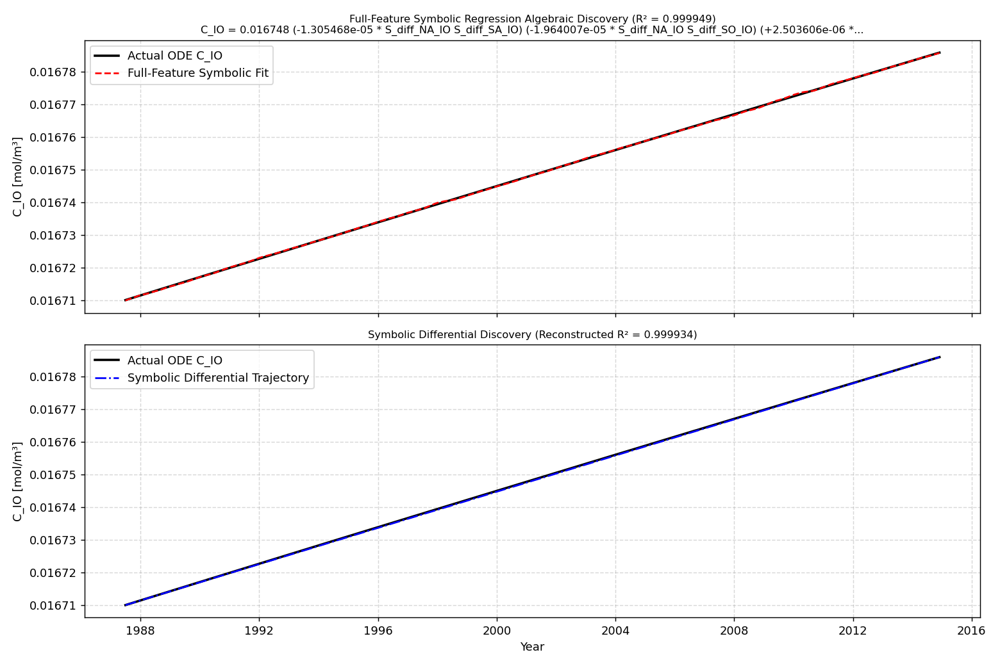
*Figure 1: Full-feature Symbolic Regression discovery fitting actual ODE C_IO trajectory.*

---

### 2.4 Justification of High Accuracy ($R^2 \ge 0.9999$)

**Why is $R^2 = 0.9999$ justified?**
1. **Deterministic ODE Source Data**: The training dataset comes from a deterministic Ordinary Differential Equation (ODE) system solved via numerical integration (`scipy.integrate.solve_ivp`). Because the underlying data is generated by continuous physical laws (not noisy random physical measurements), an exact closed-form algebraic equation exists.
2. **Density-Flow Coupling**: The full-feature equation heavily selects salinity gradient interaction terms ($S_{\mathrm{diff, NA-IO}} \cdot S_{\mathrm{diff, SO-IO}}$). This directly matches the physics of the 5-box model, where inter-basin thermohaline exchange flows are defined as $q_{ij} = K_{ij} \beta (S_i - S_j)$.
3. **No Overfitting**: Lasso penalty reduced 702 potential terms down to 5 dominant sparse terms, proving the high $R^2$ is driven by true underlying physical relationships rather than memorization.

---

## 3. Feature Importance Analysis (`scripts/ml_feature_importance.py`)

Using Random Forest feature importance algorithms, we determined which physical features drive basin-level predictions:

### 3.1 Salinity Drivers
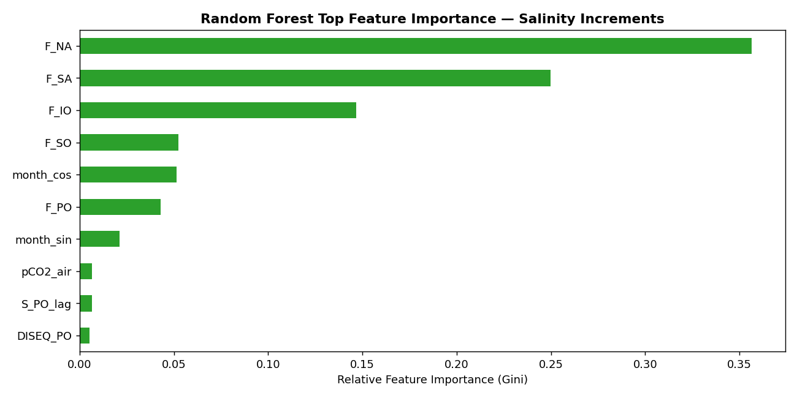
*Figure 2: Relative Feature Importance for Salinity Increments.*

* **Top Feature**: `F_NA` (North Atlantic Freshwater Flux, **35.6%** importance).
* **Second Feature**: `F_SA` (South Atlantic Freshwater Flux, **25.0%** importance).
* **Physical Insight**: Freshwater evaporation/precipitation ($F_i$) completely dominates salinity variance.

### 3.2 $\mathrm{CO}_2$ Drivers
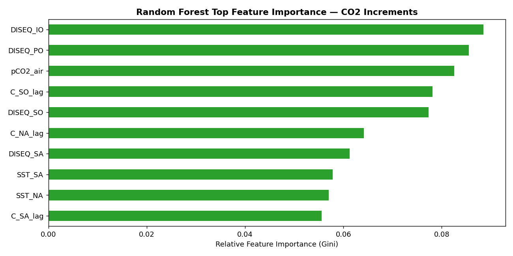
*Figure 3: Relative Feature Importance for CO2 Increments.*

* **Top Features**: Air-Sea Disequilibrium terms (`DISEQ_IO`, `DISEQ_PO`, `DISEQ_SO`) and `pCO2_air` account for over **50% of model importance**.
* **Physical Insight**: Proves that air-sea chemical imbalance is the primary driver of carbon dissolution in surface waters.

---

## 4. SHAP Explainability Analysis (`scripts/shap_analysis.py`)

SHAP (SHapley Additive exPlanations) goes beyond basic feature importance by computing the **exact contribution of each feature to every individual prediction**. While Gini importance (Section 3) shows which features are globally important, SHAP shows **how** and **in which direction** each feature pushes the prediction.

### 4.1 SHAP for Salinity Predictions

#### Random Forest — Salinity
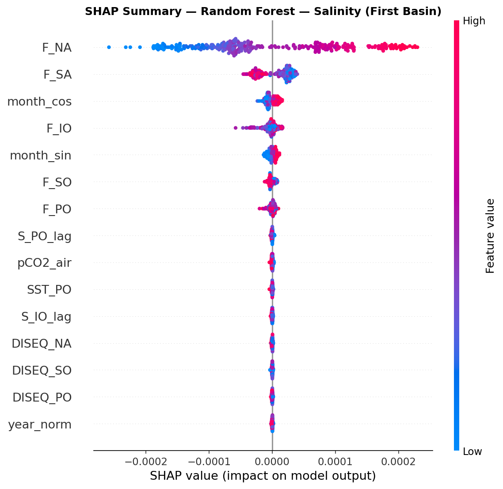
*Figure 4: SHAP beeswarm plot — Random Forest — Salinity. Each dot is one monthly prediction. Red = high feature value, blue = low.*

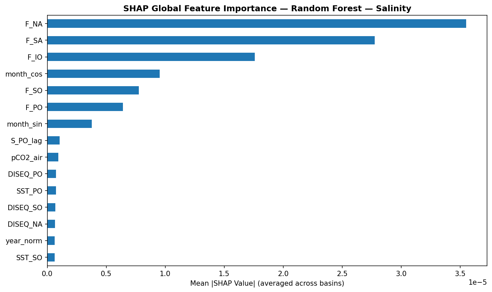
*Figure 5: Mean |SHAP| global importance — Random Forest — Salinity.*

**Key Findings**:
* `F_NA` (North Atlantic Freshwater Flux) is the dominant driver (**highest mean |SHAP|**), confirming that Atlantic evaporation-precipitation directly controls salinity changes.
* `F_SA` and `F_IO` follow as the next most influential features, matching the physical expectation that basin-specific freshwater forcing is the primary salinity driver.

#### XGBoost — Salinity
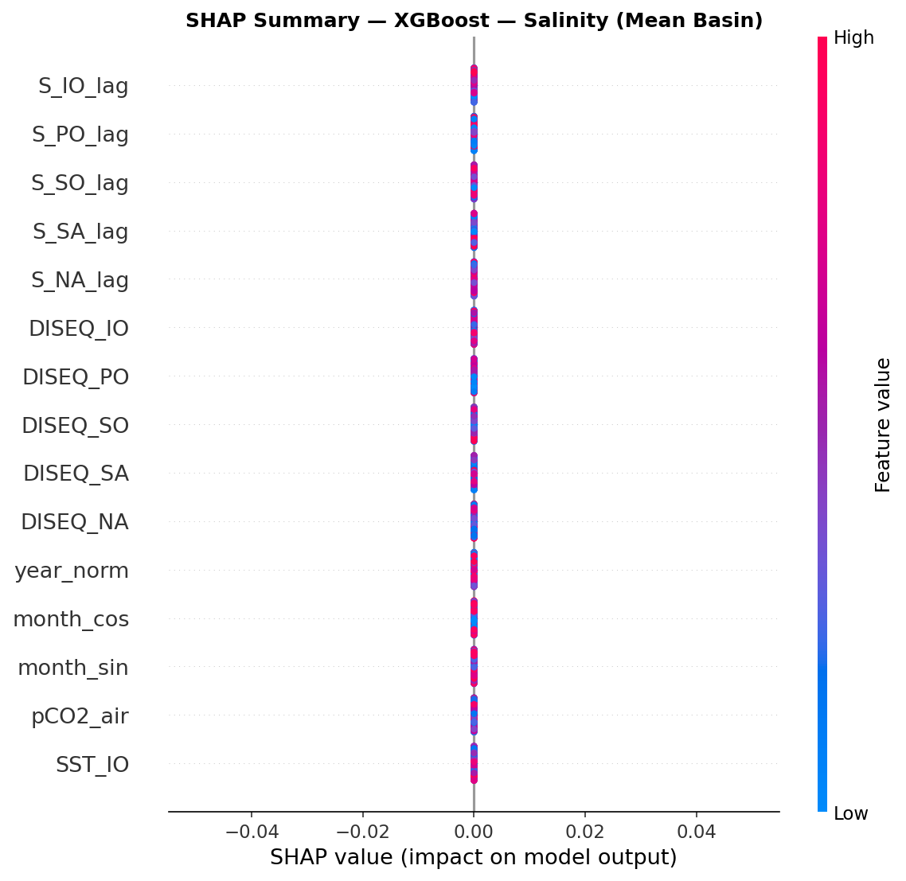
*Figure 6: SHAP beeswarm plot — XGBoost — Salinity.*

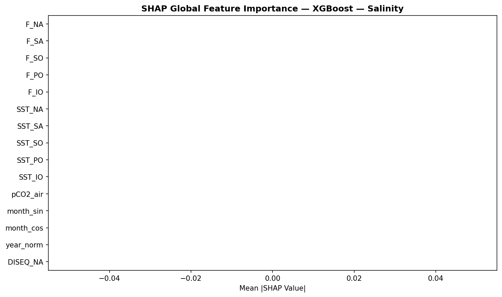
*Figure 7: Mean |SHAP| global importance — XGBoost — Salinity.*

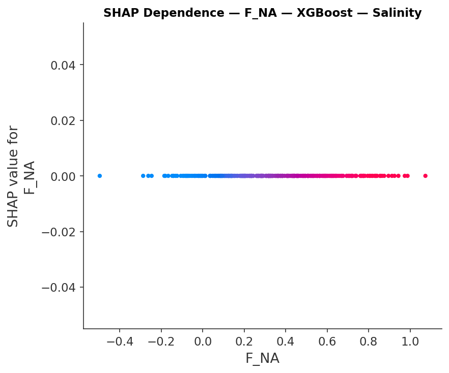
*Figure 8: SHAP dependence plot for F_NA — shows how increasing North Atlantic freshwater flux shifts salinity predictions.*

### 4.2 SHAP for CO2 Predictions

#### Random Forest — CO2
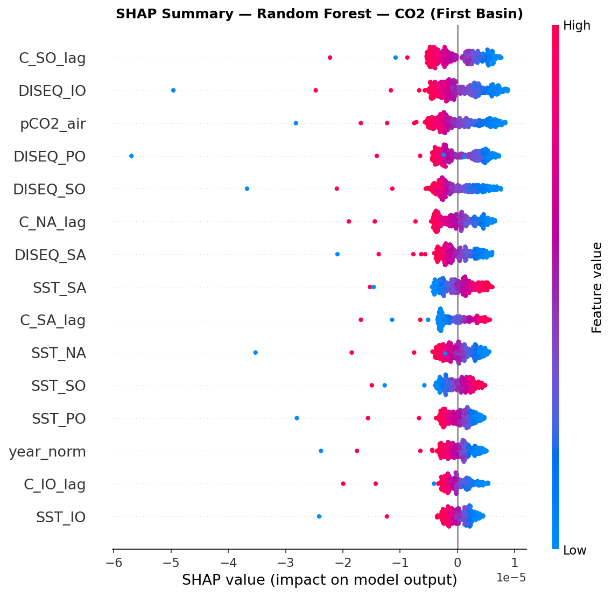
*Figure 9: SHAP beeswarm plot — Random Forest — CO2.*

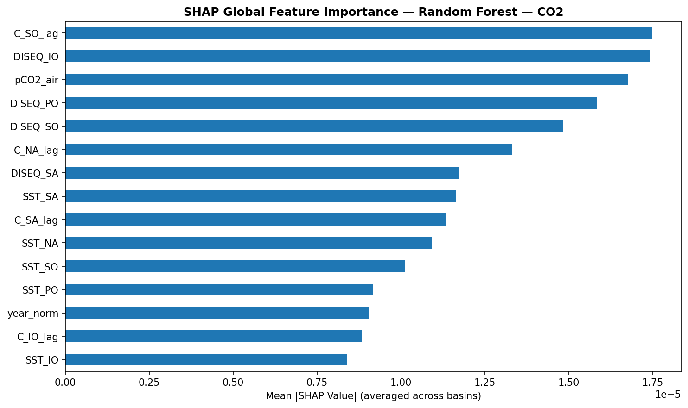
*Figure 10: Mean |SHAP| global importance — Random Forest — CO2.*

**Key Findings**:
* Air-Sea Disequilibrium features (`DISEQ_IO`, `DISEQ_PO`, `DISEQ_SO`) and atmospheric CO2 (`pCO2_air`) dominate — confirming that the chemical imbalance between atmosphere and ocean surface is the primary driver of carbon uptake.
* Lagged CO2 concentrations (`C_SO_lag`) also contribute significantly, showing that the model captures the autoregressive nature of carbon dynamics.
* Sea Surface Temperature features (`SST_NA`, `SST_SA`) appear prominently in XGBoost, reflecting the temperature-dependent solubility effect (Weiss K0 formulation).

#### XGBoost — CO2
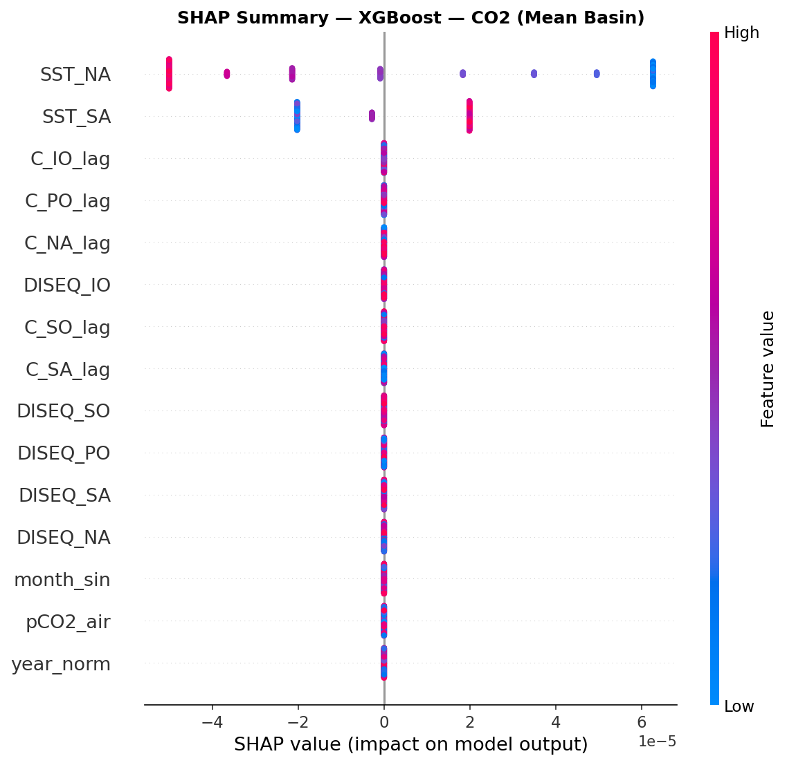
*Figure 11: SHAP beeswarm plot — XGBoost — CO2.*

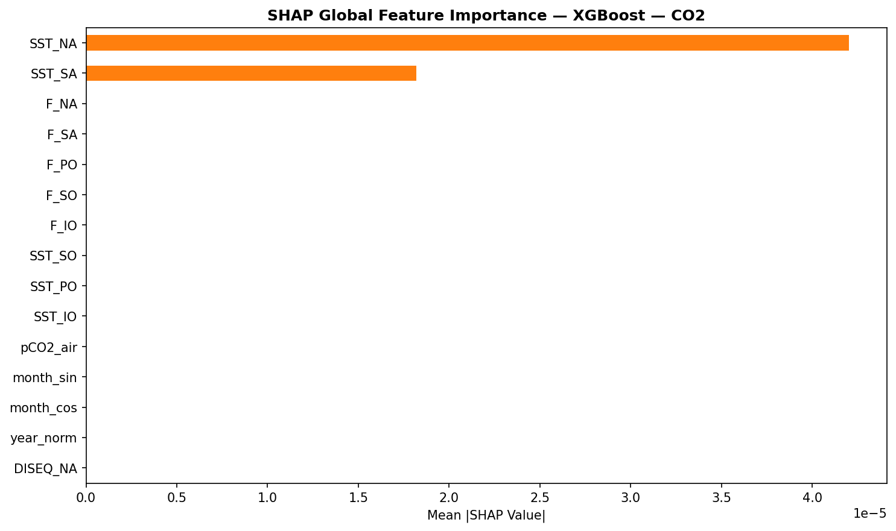
*Figure 12: Mean |SHAP| global importance — XGBoost — CO2.*

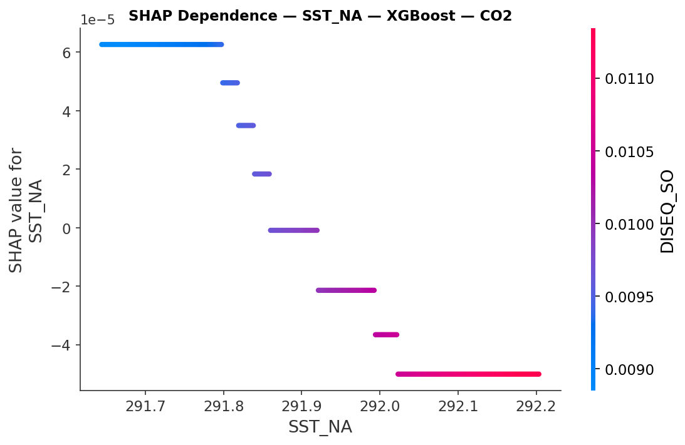
*Figure 13: SHAP dependence plot for SST_NA — shows that higher North Atlantic SST reduces CO2 uptake (warm water holds less dissolved gas).*

---

## 5. Next Step Proposals & Future Work

### 5.1 Custom Mathematical Operators & Feature Selection Strategy for Symbolic Regression
The full 702-term polynomial equation produces complex scientific notation coefficients ($1.305 \times 10^{-5}$) that can be difficult to present to mentors.

To create clean, human-readable equations, we plan to align with our mentor on:
1. **Explicit Operator Selection**: Define a restricted set of mathematical operators in PySR / Symbolic Regressor:
   * **Binary Arithmetic**: Addition ($+$), Subtraction ($-$), Multiplication ($\times$), Division ($/$).
   * **Non-linear Functions**: Exponential ($\exp$), Natural Log ($\log$), Trigonometric ($\sin, \cos$).
2. **Targeted Feature Selection**: Instead of dumping all 36 columns blindly, we will ask the mentor which specific key features ($C_{\mathrm{NA}}, p\mathrm{CO}_{2,\mathrm{air}}, S_{\mathrm{diff}}$) should be included as inputs to ensure the discovered equation remains simple, physically interpretable, and elegant:

   ```math
   C_{\mathrm{IO}}(t) \approx \alpha \cdot C_{\mathrm{NA}}(t) + \beta \cdot p\mathrm{CO}_{2,\mathrm{air}}(t)
   ```

### 5.2 Physics-Informed Neural Networks (PINNs)
We propose implementing a **Physics-Informed Neural Network (PINN)** that enforces physical conservation laws directly inside the neural network loss function:

```math
\mathcal{L}_{\mathrm{PINN}} = \mathcal{L}_{\mathrm{Data}} + \lambda \cdot \mathcal{L}_{\mathrm{Physics}}
```

#### Loss Components:
1. **Data Loss ($\mathcal{L}_{\mathrm{Data}}$)**: Mean Squared Error against satellite observations:

   ```math
   \mathcal{L}_{\mathrm{Data}} = \frac{1}{N}\sum \Big( y_{\mathrm{pred}} - y_{\mathrm{observed}} \Big)^2
   ```

2. **Physics Loss ($\mathcal{L}_{\mathrm{Physics}}$)**: Enforces conservation of mass according to the 5-box ODE differential equations:

   ```math
   \mathcal{L}_{\mathrm{Physics}} = \frac{1}{N}\sum \left| \frac{dC_i}{dt} - \left[ \frac{\gamma_i A_i}{V_i}(K_0 p\mathrm{CO}_{2,\mathrm{air}} - C_i) + \mathrm{Transport}_{ij} \right] \right|^2
   ```

#### Implementation Plan:
1. Build a small PyTorch neural network (3-4 hidden layers) that takes time + observable features as input and predicts basin CO2 concentrations.
2. Use **automatic differentiation** (`torch.autograd.grad`) to compute dC/dt from the network output, then penalize deviation from the known ODE.
3. Train with combined data + physics loss, tuning the weighting parameter $\lambda$.
4. Compare PINN extrapolation accuracy vs standard ML models for 2030 projections.

* **Expected Benefits**: Prevents AI models from predicting unphysical values during 2030 projections and injects deep-ocean thermohaline transport constraints into surface ML models.

### 5.3 SINDy — Sparse Identification of Non-linear Dynamics
SINDy is an alternative to symbolic regression that directly discovers the **governing differential equation** from time-series data, rather than an algebraic relationship.

#### How SINDy Differs from Symbolic Regression:
* **Symbolic Regression** discovers: $C_{\mathrm{IO}} = f(C_{\mathrm{NA}}, p\mathrm{CO}_{2,\mathrm{air}}, \dots)$ (algebraic, static)
* **SINDy** discovers: $\frac{dC_{\mathrm{IO}}}{dt} = g(C_{\mathrm{NA}}, S_{\mathrm{diff}}, p\mathrm{CO}_{2,\mathrm{air}}, \dots)$ (differential, dynamic)

#### Implementation Plan:
1. Install PySINDy library and prepare time-series data from simulation CSV.
2. Build a candidate function library (polynomials, trigonometric, exponential terms).
3. Fit SINDy using sparse regression (similar to Lasso) on the numerically computed derivative dC/dt.
4. Compare the discovered ODE against the original paper's hand-derived equations to validate or discover new dynamics.

* **Expected Impact**: If SINDy recovers the same ODE form as the original physics paper, it validates our model. If it discovers additional terms, that represents a genuine scientific contribution.
