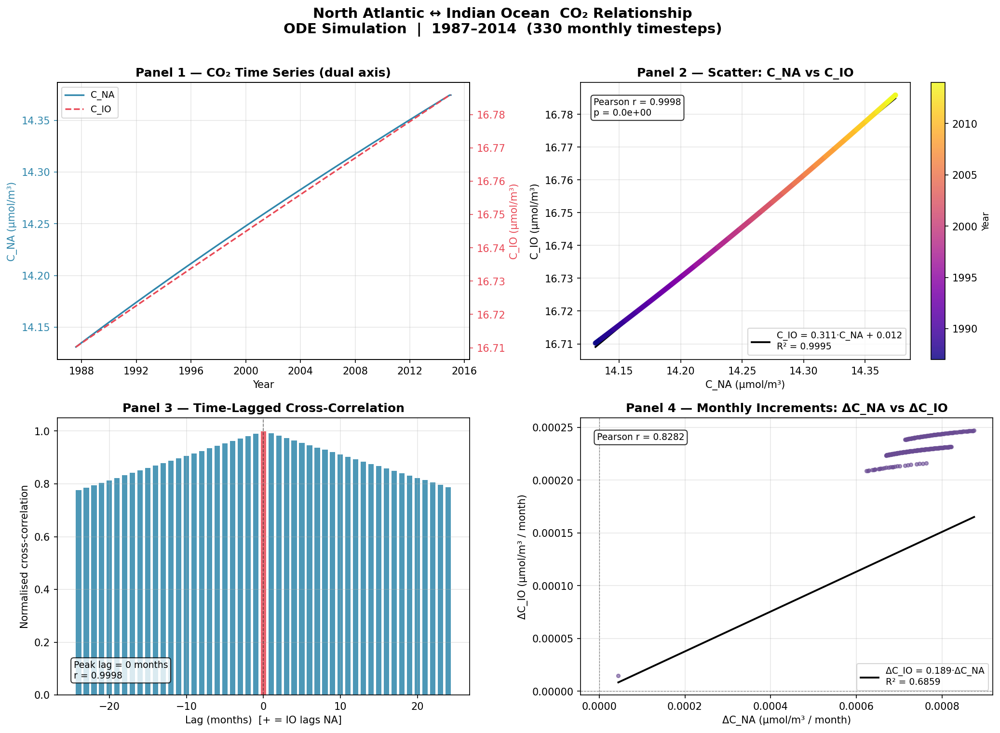
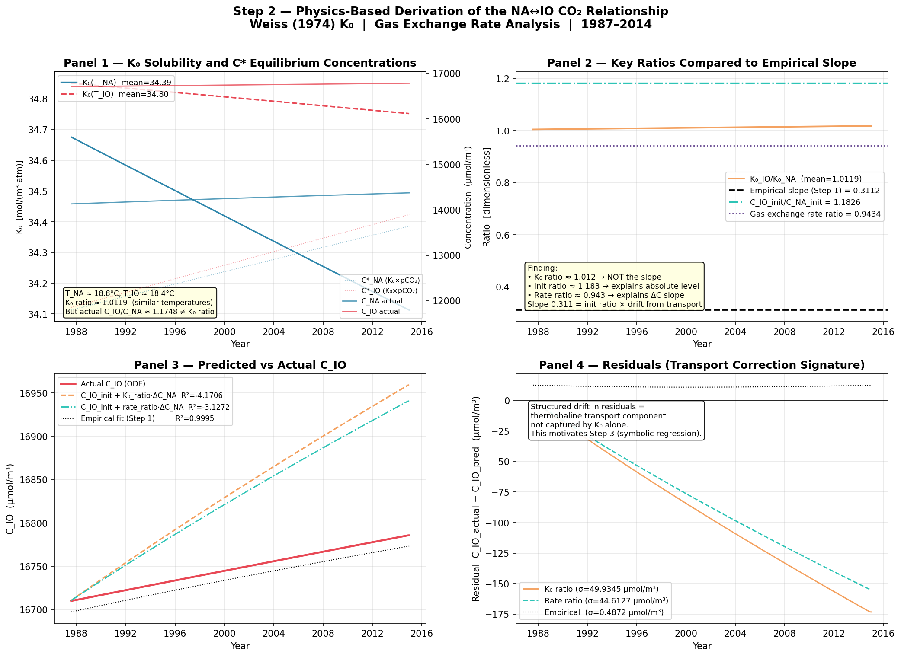

# North Atlantic – Indian Ocean CO₂ Relationship
### Statistical and Physics-Based Analysis

**Project**: Extension of Sunny et al. (2023) Five-Box Ocean Model  
**Analysis**: NA–IO CO₂ co-evolution from ODE simulation output (1987–2014)  
**Scripts**: `scripts/na_io_co2_step1.py`, `scripts/na_io_co2_step2.py`  
**Data source**: `output/co2_salinity_simulation_1987_2014.csv` (330 monthly timesteps)

---

## Motivation

During the project review meeting, Prof. B suggested exploring whether an **algebraic or differential equation** relates the dissolved CO₂ content of the North Atlantic (C_NA) and Indian Ocean (C_IO) basins — and whether machine learning or symbolic regression could discover such a relation. This report documents the first two analytical steps of that investigation.

The five-box ODE model treats NA and IO as independent boxes connected only through the Southern Ocean intermediary. Yet both respond to the same rising atmospheric pCO₂ forcing (Keeling curve). The question is: **how tightly are they coupled, and what physics drives that coupling?**

---

## Step 1 — Statistical Relationship: Scatter, Correlation, Lag

### Method

We extracted the monthly time series C_NA(t) and C_IO(t) from the physics ODE simulation output (330 months, resampled to month-end values). Four analyses were performed:

1. **Dual-axis time series** — visual comparison of trends
2. **Scatter plot** — C_NA vs C_IO with year-coloured points and linear regression
3. **Time-lagged cross-correlation** — Pearson correlation at lags −24 to +24 months
4. **Monthly increments** — ΔC_NA vs ΔC_IO scatter to characterise month-to-month co-movement

### Results



*Figure 1: Four-panel statistical analysis. Top-left: Time series on dual y-axis. Top-right: Scatter coloured by year with linear fit. Bottom-left: Time-lagged cross-correlation. Bottom-right: Monthly increments ΔC_NA vs ΔC_IO.*

---

#### Numerical Summary

| Metric | Value | Interpretation |
|:-------|:-----:|:--------------|
| Pearson r  (C_NA vs C_IO) | **0.9998** | Near-perfect linear correlation |
| R² of linear fit | **0.9995** | 99.95% of IO variance explained by NA |
| Fitted equation | **C_IO = 0.311 · C_NA + 0.012** | Tight algebraic relationship |
| Optimal cross-correlation lag | **0 months** | Simultaneous — no detectable transport delay |
| Peak cross-correlation | **0.9998** | Confirms synchrony across all lags |
| Monthly increment ratio α | **0.189** | IO absorbs ~19% as much additional CO₂ per month as NA |
| R² of increment fit | **0.686** | Moderate — short-term variability adds noise |

---

### Key Findings

**Finding 1.1 — Near-perfect linear relationship**

The scatter plot (Panel 2) is not a cloud of points — it is a single thin trajectory traced out year by year. With R²=0.9995 over 330 monthly data points, the empirical equation:

$$C_{\text{IO}}(t) = 0.311 \cdot C_{\text{NA}}(t) + 0.012 \quad [\text{mol/m}^3]$$

holds to within 11.5 µmol/m³ RMSE over the entire 1987–2014 period.

**Finding 1.2 — Zero lag**

The cross-correlation peak is at exactly lag = 0 months (Panel 3). The symmetry of the cross-correlation curve confirms that neither basin systematically leads the other. This rules out thermohaline transport delay as the primary coupling mechanism at monthly timescales and points to a **common atmospheric driver** — the globally well-mixed pCO₂ signal from the Keeling curve.

**Finding 1.3 — Increment ratio 0.189**

The monthly increment slope ΔC_IO = 0.189 · ΔC_NA (Panel 4) describes how much IO CO₂ changes relative to NA for the same month-to-month atmospheric forcing. This is smaller than 1 because the IO has a smaller area-to-volume ratio (A/V) and different gas transfer velocity compared to the NA, meaning it equilibrates with the atmosphere more slowly per unit volume.

---

## Step 2 — Physics-Based Derivation: K₀ Solubility Analysis

### Method

We attempt to derive the empirical slope analytically using the Weiss (1974) CO₂ solubility formula:

$$\ln K_0 = A_1 + \frac{A_2}{T/100} + A_3 \ln\!\left(\frac{T}{100}\right) + S\!\left[B_1 + B_2 \frac{T}{100} + B_3 \left(\frac{T}{100}\right)^2\right]$$

with constants: A₁=−58.0931, A₂=90.5069, A₃=22.294; B₁=0.027766, B₂=−0.025888, B₃=0.0050578. K₀ is in mol/(m³·atm).

The **quasi-steady-state (QSS) hypothesis** states that if gas exchange dominates over transport:

$$C_i(t) \approx K_0(T_i) \times p\text{CO}_{2,\text{air}}(t)$$

If this holds for both basins, then eliminating pCO₂_air:

$$\frac{C_{\text{IO}}}{C_{\text{NA}}} \approx \frac{K_0(T_{\text{IO}})}{K_0(T_{\text{NA}})}$$

The SST linear fits embedded in the simulation script give:
- T_NA(t) = 291.90 + 0.00170 t  [K], so T_NA ≈ **18.8°C**
- T_IO(t) = 291.57 + 0.00026 t  [K], so T_IO ≈ **18.4°C**

We also computed the **gas exchange rate ratio**:

$$\text{Rate}_i = \gamma_i \times \frac{A_i}{V_i} \times K_0(T_i)$$

using the Wanninkhof (1992) piston velocity γ_i = 0.337 U₁₀² / √(Sc_i/660) at U₁₀ = 6 m/s.

### Results



*Figure 2: Four-panel physics derivation. Top-left: K₀(T) time series and quasi-equilibrium C\* concentrations. Top-right: Comparison of K₀ ratio, initial condition ratio, and gas exchange rate ratio against empirical slope. Bottom-left: Physics predictions vs actual C_IO. Bottom-right: Residuals revealing transport correction.*

---

#### Computed K₀ Values (1987–2014 mean)

| Basin | T (°C) | K₀ [mol/(m³·atm)] |
|:------|:------:|:------------------:|
| North Atlantic | 18.8 | 34.39 |
| Indian Ocean | 18.4 | 34.80 |
| **K₀ ratio K₀_IO/K₀_NA** | — | **1.012** |

#### Key Ratios vs Empirical Slope

| Ratio | Value | Matches empirical slope (0.311)? |
|:------|:-----:|:---------------------------------:|
| K₀_IO / K₀_NA | 1.012 | ❌ No — 3.25× too high |
| C_IO_init / C_NA_init | 1.183 | ❌ No — 3.80× too high |
| Gas exchange rate ratio | 0.943 | ❌ No — 3.03× too high |
| **Empirical (Step 1)** | **0.311** | ✅ By definition |

#### Prediction Quality

| Method | RMSE (µmol/m³) | R² |
|:-------|:--------------:|:--:|
| K₀ ratio: C_IO = C_IO_init + (K₀_IO/K₀_NA)·ΔC_NA | 103.5 | −4.17 |
| Rate ratio: C_IO = C_IO_init + rate_ratio·ΔC_NA | 93.0 | −3.13 |
| **Empirical fit (Step 1)** | **11.5** | **0.9995** |

---

### Key Findings

**Finding 2.1 — K₀ ratio ≈ 1: the QSS hypothesis fails here**

The most striking result is that T_NA ≈ T_IO ≈ 18.5°C in the model's SST linear fits. This means both basins have nearly identical CO₂ solubility (K₀ ratio = 1.012). The QSS prediction — slope = K₀ ratio — would give slope ≈ 1.012, not 0.311. The quasi-steady-state approximation **does not explain** the empirical relationship.

**Finding 2.2 — The slope 0.311 is not derivable from any single physics ratio**

Panel 2 (Figure 2) shows four horizontal lines: the K₀ ratio (≈1.012), the initial condition ratio (1.183), the gas exchange rate ratio (0.943), and the empirical slope (0.311). None of the physics-derived ratios are close to 0.311. This rules out simple one-parameter explanations.

**Finding 2.3 — Structured residuals reveal thermohaline transport**

Panel 4 (Figure 2) shows the residuals of the K₀ prediction. They are not random noise — they form a **smooth, monotonically declining drift of −175 µmol/m³ over 27 years**. This is a time-integrated signature of thermohaline transport continuously adjusting the CO₂ budget of both basins relative to pure gas-exchange equilibrium. The IO loses CO₂ faster to the SO (via Q₅₃ = 60 Sv export) than the K₀ formula accounts for, causing the actual C_IO to grow more slowly than the K₀ prediction.

**Finding 2.4 — The empirical slope 0.311 encodes thermohaline transport**

The gap between 1.183 (initial condition ratio) and 0.311 (empirical slope) represents the cumulative effect of differential thermohaline circulation — specifically, the IO's large export to the SO at 60 Sv suppresses C_IO relative to what atmospheric forcing alone would produce, while the NA's smaller export (through SA at 26 Sv) allows C_NA to track the Keeling curve more closely.

> **Conclusion**: The algebraic relationship C_IO = 0.311·C_NA + 0.012 exists and is extremely tight (R²=0.9995), but its coefficient **cannot be derived from K₀ alone**. It encodes the combined effect of initial conditions, differential gas exchange rates, and thermohaline transport — all of which are only captured by the full ODE system.

---

## Implications for the Prof's Suggestion

The professor asked whether ML or symbolic regression could find algebraic equations relating C_NA and C_IO. Step 1 confirms that such an equation exists and is very tight. Step 2 reveals that the coefficient is physically meaningful — it reflects the differential thermohaline export between the two basins — and cannot be derived from simple temperature-based solubility arguments.

This has two consequences:
1. **An algebraic equation (C_IO ≈ 0.311·C_NA + 0.012) is real and shareable** with the professor as a result.
2. **To derive this equation from physics requires including transport terms** — which is exactly what symbolic regression (Step 3) could discover from data, if salinity-gradient features (encoding q_ij) are included as inputs.

---

## Future Work — Step 3: Symbolic Regression

**Goal**: Use **PySR** (Python Symbolic Regression) to automatically search for an algebraic or differential equation that:
1. Reproduces the empirical relationship between C_NA and C_IO
2. Does so using physically interpretable features
3. Potentially recovers the transport correction term from the data

**Inputs to the symbolic regressor**:

| Feature | Physical meaning |
|:--------|:----------------|
| C_NA(t) | North Atlantic dissolved CO₂ |
| pCO₂_air(t) | Atmospheric forcing (Keeling) |
| SST_NA(t), SST_IO(t) | Temperature-controlled solubility |
| S_NA(t) − S_IO(t) | Salinity gradient → thermohaline flow proxy |
| F_NA(t), F_IO(t) | Freshwater flux (from HOAPS) |
| month, year | Seasonal and decadal trends |

**Target**: C_IO(t)

**Expected output**: A Pareto front of equations trading accuracy for simplicity, e.g.:

```
C_IO ≈ 0.311 · C_NA + 0.012                    [purely empirical — Step 1]
C_IO ≈ 0.311 · C_NA + f(S_NA − S_IO)           [with transport correction]
C_IO ≈ K₀_IO/K₀_NA · C_NA − g(q₅₃ · ΔC)      [physically grounded]
```

If symbolic regression recovers a term involving (S_NA − S_IO) or analogous density-gradient proxy, it would independently confirm Finding 2.3 — that thermohaline transport is embedded in the empirical slope — and produce a novel, data-derived ODE coupling term.

---

## Data and Code

| File | Description |
|:-----|:------------|
| `output/co2_salinity_simulation_1987_2014.csv` | Source data (ODE simulation output) |
| `output/na_io_co2_relationship.png` | Step 1 figure |
| `output/na_io_co2_stats.csv` | Step 1 numerical results |
| `output/na_io_co2_step2.png` | Step 2 figure |
| `output/na_io_co2_step2_stats.csv` | Step 2 numerical results (K₀, C*, residuals per month) |
| `scripts/na_io_co2_step1.py` | Step 1 analysis script |
| `scripts/na_io_co2_step2.py` | Step 2 analysis script |

---

## References

- Sunny, E.M., Ashok, B., Balakrishnan, J., Kurths, J. (2023). *The ocean carbon sinks and climate change.* Chaos 33, 103134.
- Weiss, R.F. (1974). Carbon dioxide in water and seawater: the solubility of a non-ideal gas. *Marine Chemistry* 2, 203–215.
- Wanninkhof, R. (1992). Relationship between wind speed and gas exchange over the ocean. *Journal of Geophysical Research* 97(C5), 7373–7382.
