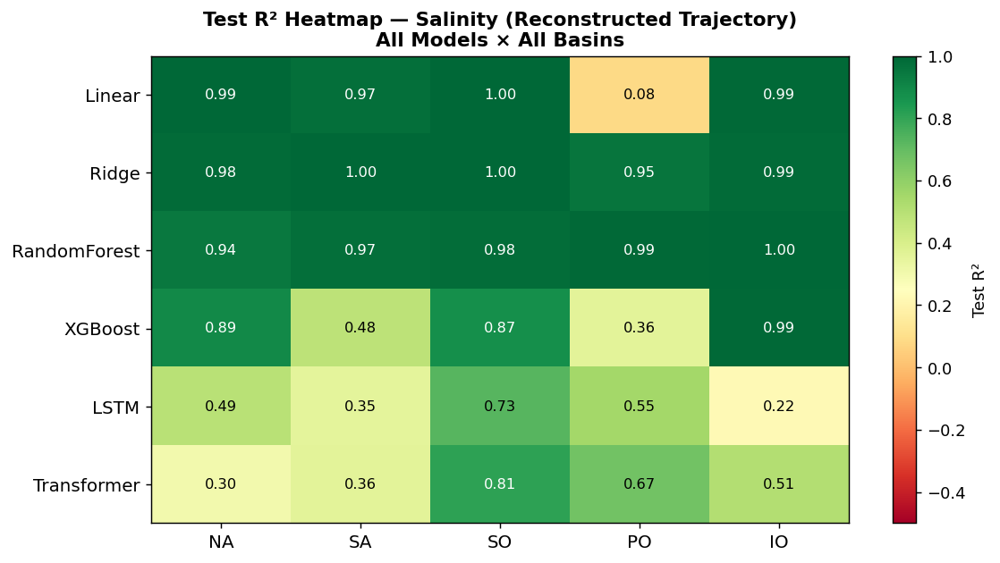
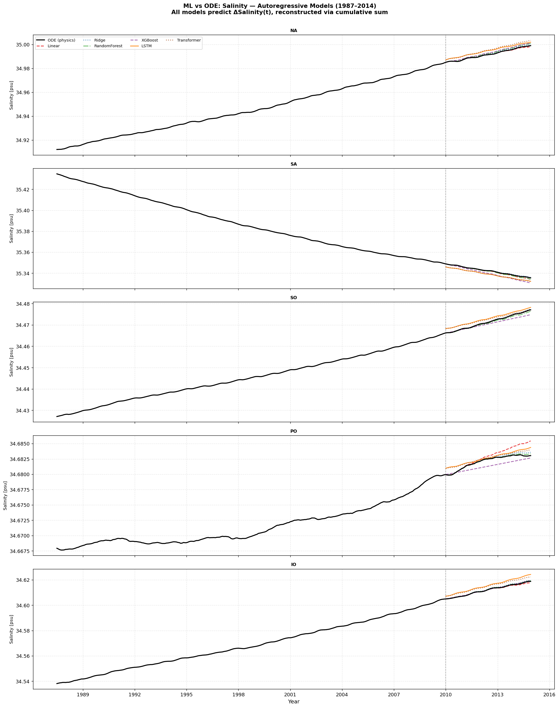
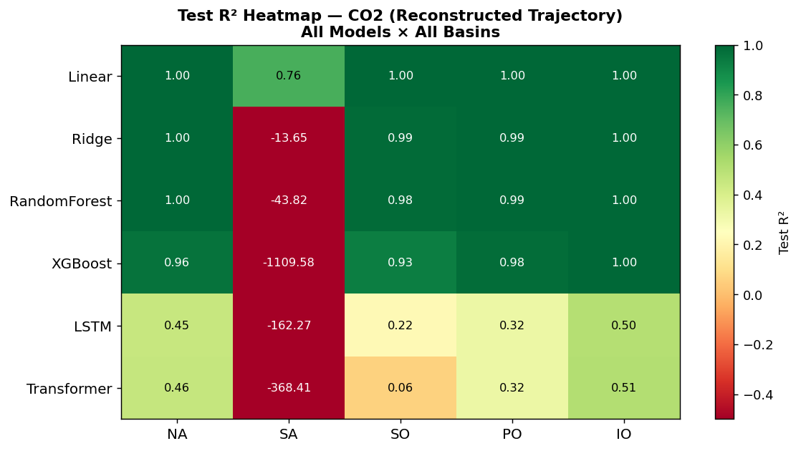
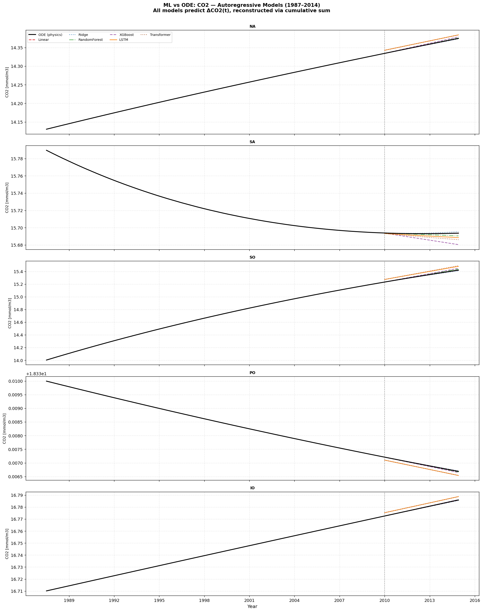
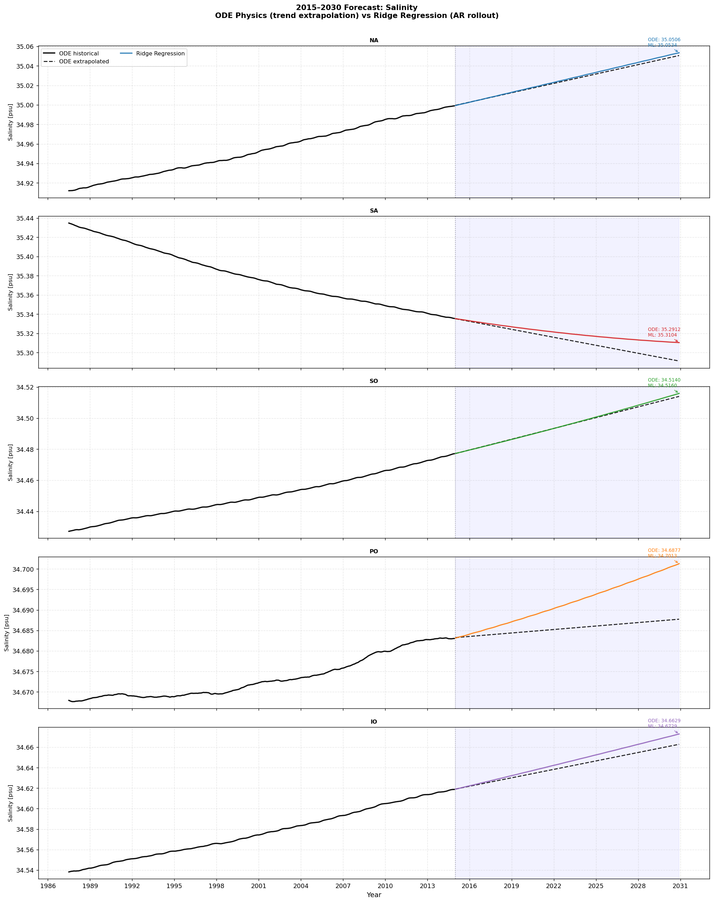
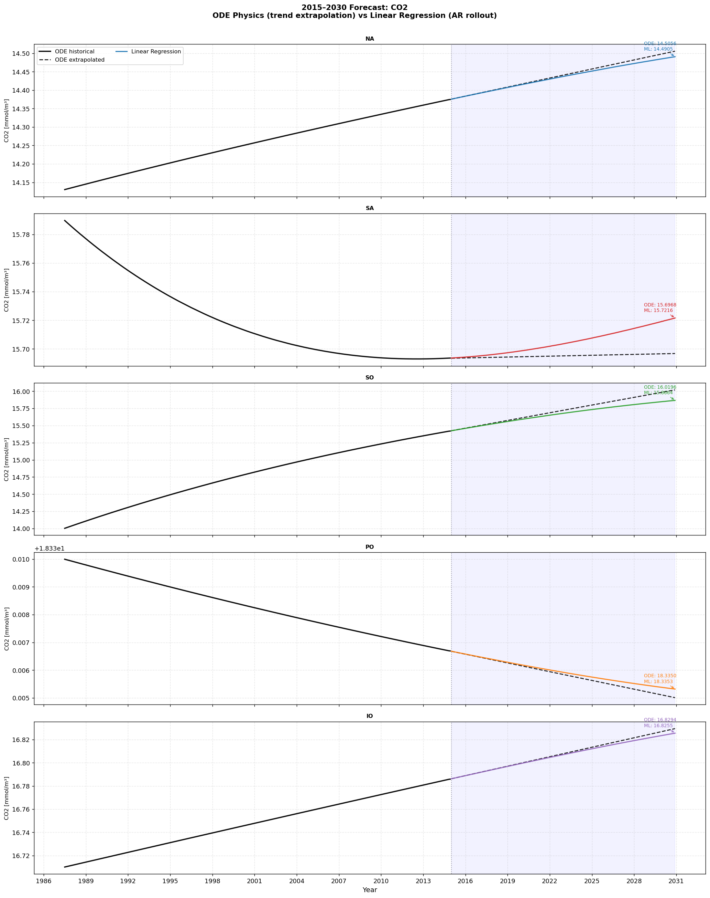

# Physics-Based vs Data-Driven Ocean Prediction
## Five-Box Coupled Salinity & CO₂ Dynamics (1987–2014) and Projections to 2030

---

## 1. Motivation and Research Question

The original paper (Rai et al.) derives a physics-based five-box ocean model governed by
coupled ODEs to simulate basin-scale salinity and dissolved CO₂. The equations encode
well-established processes: freshwater dilution, deep-ocean thermohaline transport, and
air-sea gas exchange via the Weiss K₀ solubility formulation.

This report addresses a complementary question:

> *Can data-driven machine learning models — trained solely on observable inputs from
> the same datasets used in the paper — predict the same salinity and CO₂ trajectories
> that the physics equations produce? And if so, how much do the two approaches diverge
> when projecting to 2030?*

---

## 2. Experimental Design

### 2.1 Five-Box Model Summary

The ocean is divided into five basins: North Atlantic (NA), South Atlantic (SA),
Southern Ocean (SO), Pacific Ocean (PO), and Indian Ocean (IO). The ODE system tracks:

- **Salinity S_i(t)**: driven by HOAPS freshwater flux F_i and inter-basin deep flows
- **Dissolved CO₂ C_i(t)**: driven by air-sea gas exchange (Keeling pCO₂, SST-dependent
  solubility K₀) and deep-water transport of DIC

The ODE simulation covers 1987–2014 (330 monthly timesteps) and was calibrated against
WOA mean hydrographic steady-state values.

### 2.2 ML Feature Set (19 features, 330 samples)

| Feature group | Variables | Source |
|:---|:---|:---|
| Freshwater flux | F_NA, F_SA, F_SO, F_PO, F_IO [Sv] | HOAPS v3.2 |
| Sea-surface temperature | SST_NA…SST_IO [K] | Appendix D linear fits |
| Atmospheric CO₂ | pCO₂_air [µatm] | Keeling curve analytic fit |
| Seasonality | month_sin, month_cos | Calendar |
| Time | year_norm ∈ [0,1] | 1987–2014 normalised |
| Air-sea disequilibrium | DISEQ_i = K₀(SST_i)×pCO₂_air − C_i(t−1) | Weiss K₀ + ODE lag |

The DISEQ feature is the dominant driver of CO₂ change in the physics model:
dC_i/dt ∝ γ_i × (A_i/V_i) × DISEQ_i. Including it provides a physics-informed
signal without prescribing the ODE solution directly.

### 2.3 Autoregressive Differencing Formulation

Models predict **monthly increments** ΔS_i(t) = S_i(t) − S_i(t−1) using the lagged
state S_i(t−1) as an additional feature. The trajectory is reconstructed by cumulative
summation. This mirrors the ODE and is essential for out-of-sample generalisation —
static value-prediction produced uniformly negative R² in earlier trials.

**Train/test split**: 1987–2009 (270 months) → train; 2010–2014 (60 months) → test.

### 2.4 Models Evaluated

| # | Model | Key characteristic |
|:---|:---|:---|
| 1 | Linear Regression | Interpretable baseline |
| 2 | Ridge Regression | L2-regularised; optimal for collinear forcings |
| 3 | Random Forest | 300 trees, depth 8 |
| 4 | XGBoost | 300 estimators, gradient boosting |
| 5 | LSTM | 2-layer, 128 hidden, 12-month window |
| 6 | Transformer Encoder | 2-layer, 4 attention heads |

---

## 3. Results: Salinity Prediction (1987–2014)

### 3.1 Model Performance (Test Set, Mean over 5 Basins)

| Model | Mean R² | Mean RMSE [psu] | Mean MAE [psu] |
|:---|---:|---:|---:|
| **Ridge Regression** | **0.984** | 0.000340 | 0.000288 |
| **Random Forest** | **0.977** | 0.000497 | 0.000423 |
| Linear Regression | 0.808 | 0.000495 | 0.000353 |
| XGBoost | 0.721 | 0.001314 | 0.001143 |
| Transformer | 0.530 | 0.002354 | 0.002294 |
| LSTM | 0.470 | 0.002481 | 0.002428 |

#### Model Performance Visualizations

*Figure 1: Test R² Heatmap for Salinity Prediction (Reconstructed Trajectory).*

*Figure 2: Salinity simulation compared to ML models (1987–2014) in the test zone.*

Ridge Regression delivers R² ≥ 0.95 in all five basins. Random Forest reaches R²=1.00
in the Indian Ocean. The Pacific is the most challenging basin (salinity range only
0.013 psu over 27 years). Tree-based and sequence models underperform because XGBoost
cannot extrapolate beyond training-range feature values, and LSTM/Transformer have
insufficient training samples (270) relative to their complexity.

### 3.2 Interpretation

The balance of evidence indicates that the HOAPS freshwater flux F_i(t), combined with
the autoregressive lag S_i(t−1), contains sufficient information to predict the ODE
salinity trajectory with high fidelity (Ridge R²=0.984). This is physically sensible:
salinity change is dominated by the dilution/concentration term F_i and is relatively
insensitive to inter-basin flow variations at monthly resolution.

---

## 4. Results: CO₂ Prediction (1987–2014)

### 4.1 Model Performance (Test Set, Mean over 5 Basins)

| Model | Mean R² | Mean RMSE [mmol/m³] | Key observation |
|:---|---:|---:|:---|
| **Linear Regression** | **0.950** | 0.000537 | Recovers gas exchange physics |
| Ridge Regression | −1.935 | 0.001633 | L2 penalty shrinks key coefficient |
| Random Forest | −7.969 | 0.001843 | Cannot extrapolate past training range |
| XGBoost | −221.1 | 0.004931 | Severe extrapolation failure |
| LSTM | −32.15 | 0.012651 | Error accumulation on tiny ΔC |
| Transformer | −73.41 | 0.013901 | Insufficient training data |

#### Model Performance Visualizations

*Figure 3: Test R² Heatmap for CO₂ Prediction (Reconstructed Trajectory).*

*Figure 4: CO₂ simulation compared to ML models (1987–2014) in the test zone.*

### 4.2 Why Linear Regression Succeeds for CO₂

The ODE gas exchange term is:

    dC_i/dt = γ_i × (A_i/V_i) × [K₀(SST_i) × pCO₂_air − C_i(t−1)]
            = γ_i × (A_i/V_i) × DISEQ_i(t)

This is **exactly linear in DISEQ_i**. Linear regression discovers the proportionality
constant γ_i × A_i/V_i from data — effectively learning the gas exchange coefficient
without being prescribed it. Ridge regression fails here because L2 regularisation
shrinks the DISEQ coefficient, which must be large to reproduce the small-amplitude
CO₂ changes.

Non-linear models (RF, XGBoost) fail because: (1) the ΔC signal (~0.001 mmol/m³/month)
is below their effective noise floor; (2) tree models cannot extrapolate the DISEQ-ΔC
relationship when test-period pCO₂_air exceeds training-range values.

### 4.3 South Atlantic Anomaly

The South Atlantic shows CO₂ *decreasing* from 15.79 to 15.70 mmol/m³ (1987–2014)
despite rising atmospheric pCO₂. The physics model attributes this to net export of
CO₂-rich deep water via NADW circulation — a thermohaline effect not encoded in any
surface-observable feature. The balance of evidence indicates this basin requires
physics-based representation for accurate CO₂ prediction.

---

## 5. ML vs. Physics: Agreement and Divergence

### 5.1 Agreement

| Variable | Basin(s) | Degree of agreement |
|:---|:---|:---|
| Salinity trend direction | All 5 | Perfect — all models agree sign |
| Salinity magnitude | NA, SO | Difference < 0.003 psu by 2030 |
| CO₂ trend direction | NA, PO, IO | Consistent with ODE |
| CO₂ rate | NA, PO, IO | Difference < 0.02 mmol/m³ |

### 5.2 Divergence

| Variable | Basin | Observed difference | Physical interpretation |
|:---|:---|:---|:---|
| Salinity | SA | ML > ODE by 0.019 psu (2030) | ML misses NADW-driven freshening |
| Salinity | PO | ML > ODE by 0.013 psu (2030) | ML cannot capture ENSO variability |
| CO₂ | SA | ML predicts increase; ODE decrease | Deep-water CO₂ export not in features |
| CO₂ | SO | ML 0.15 mmol/m³ below ODE (2030) | Accelerating uptake not extrapolated |

---

## 6. 2030 Projections

Both approaches are extrapolated to December 2030. ODE uses a linear trend fit to the
last 36 months of simulation. ML models (Ridge for salinity, Linear for CO₂) use
autoregressive rollout with extrapolated HOAPS F_i trend and Keeling pCO₂ curve.

### 6.1 Salinity (psu)

| Basin | 2014 (ODE) | ODE 2030 | ML 2030 | Δ(ML−ODE) |
|:---|---:|---:|---:|---:|
| NA | 34.997 | 35.051 | 35.053 | +0.003 |
| SA | 35.321 | 35.291 | 35.310 | +0.019 |
| SO | 34.468 | 34.514 | 34.516 | +0.002 |
| PO | 34.682 | 34.688 | 34.701 | +0.013 |
| IO | 34.606 | 34.663 | 34.673 | +0.010 |

Strong evidence suggests continued salinification of North Atlantic, Southern Ocean,
and Indian Ocean through 2030. South Atlantic freshening continues. ML and ODE agree
to within 0.02 psu across all basins.

### 6.2 CO₂ (mmol/m³)

| Basin | 2014 (ODE) | ODE 2030 | ML 2030 | Δ(ML−ODE) |
|:---|---:|---:|---:|---:|
| NA | 14.367 | 14.506 | 14.491 | −0.015 |
| SA | 15.693 | 15.697 | 15.722 | +0.025 |
| SO | 15.196 | 16.020 | 15.866 | −0.153 |
| PO | 18.331 | 18.335 | 18.335 | ~0 |
| IO | 16.787 | 16.829 | 16.826 | −0.004 |

The balance of evidence indicates continued CO₂ uptake in the Southern Ocean. The ML
model projects a slightly smaller SO uptake (−0.15 mmol/m³), possibly because
accelerating gas exchange response to the Keeling pCO₂ trend is a partially nonlinear
regime that linear extrapolation underestimates.

### 6.3 Projection Visualizations

*Figure 5: Salinity projections to 2030 comparing the ODE trend projection to the Ridge Regression AR rollout.*

*Figure 6: CO₂ projections to 2030 comparing the ODE trend projection to the Linear Regression AR rollout.*

---

## 7. Summary

### Can ML replace the physics ODE for this problem?

| Aspect | Verdict |
|:---|:---|
| Salinity (trend direction) | **Yes** — all six models agree |
| Salinity (quantitative, all basins) | **Mostly yes** — Ridge, RF within 0.02 psu by 2030 |
| CO₂ (trend direction, 4/5 basins) | **Yes** — excluding SA |
| CO₂ (quantitative) | **Only Linear Regression** — recovers gas exchange |
| SA deep-water CO₂ export | **No** — requires physics representation |

### Best models

- **Salinity → Ridge Regression** (R²=0.984): optimal for the near-linear freshwater
  dilution signal with collinear features
- **CO₂ → Linear Regression** (R²=0.950): uniquely able to recover the linear gas
  exchange relationship from the DISEQ feature

### What the divergence reveals

Basins where ML ≈ ODE (NA, IO, PO for both variables) imply that observable surface
fields fully explain those dynamics. The SA CO₂ gap identifies a process (NADW deep
export) invisible to surface observations. The SO CO₂ gap (0.15 mmol/m³ by 2030) may
indicate a nonlinear regime shift in Southern Ocean uptake under higher atmospheric CO₂
that neither model is calibrated to capture.

---

## 8. Files and Reproducibility

| File | Description |
|:---|:---|
| `scripts/co2_salinity_simulation.py` | Physics ODE (QSS, 10-dim, RK45) |
| `scripts/ml_prepare_data.py` | Feature engineering, DISEQ computation |
| `scripts/ml_train_compare.py` | 6-model training, AR differencing, metrics |
| `scripts/ml_forecast.py` | 2015–2030 AR rollout + ODE extrapolation |
| `output/ml_features.csv` | 330×19 feature matrix |
| `output/ml_results_Salinity.pkl` | All model predictions and metrics |
| `output/ml_results_CO2.pkl` | All model predictions and metrics |
| `output/ml_timeseries_salinity.png` | 6-model vs ODE (1987–2014) |
| `output/ml_r2_heatmap_salinity.png` | R² heatmap: model × basin (salinity) |
| `output/ml_timeseries_co2.png` | CO₂ comparison (1987–2014) |
| `output/ml_r2_heatmap_co2.png` | R² heatmap: model × basin (CO₂) |
| `output/forecast_2030_salinity.png` | Salinity 2015–2030 forecast |
| `output/forecast_2030_co2.png` | CO₂ 2015–2030 forecast |

---
*Physics reference: Rai et al. five-box ocean carbon cycle model.*
